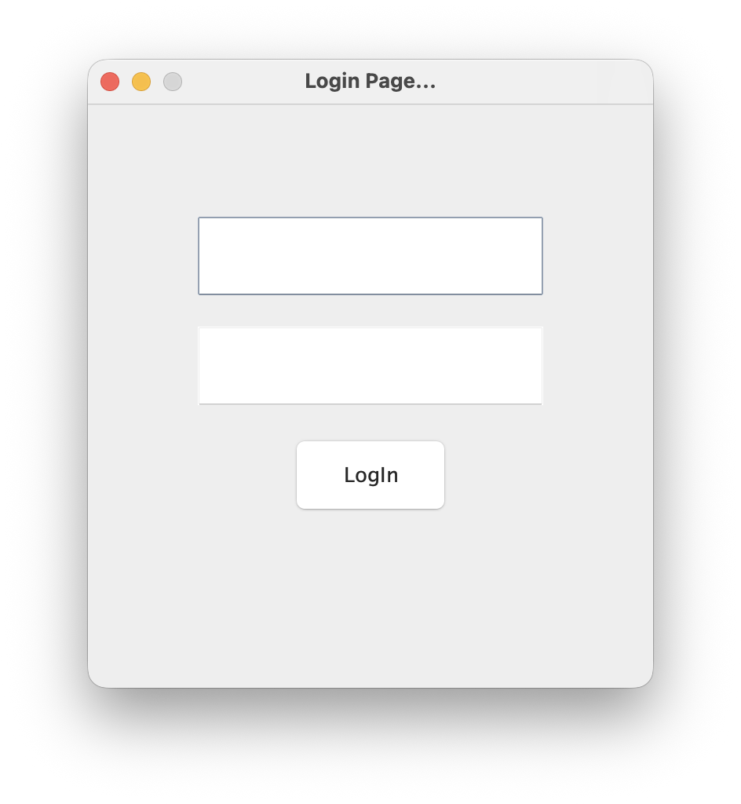
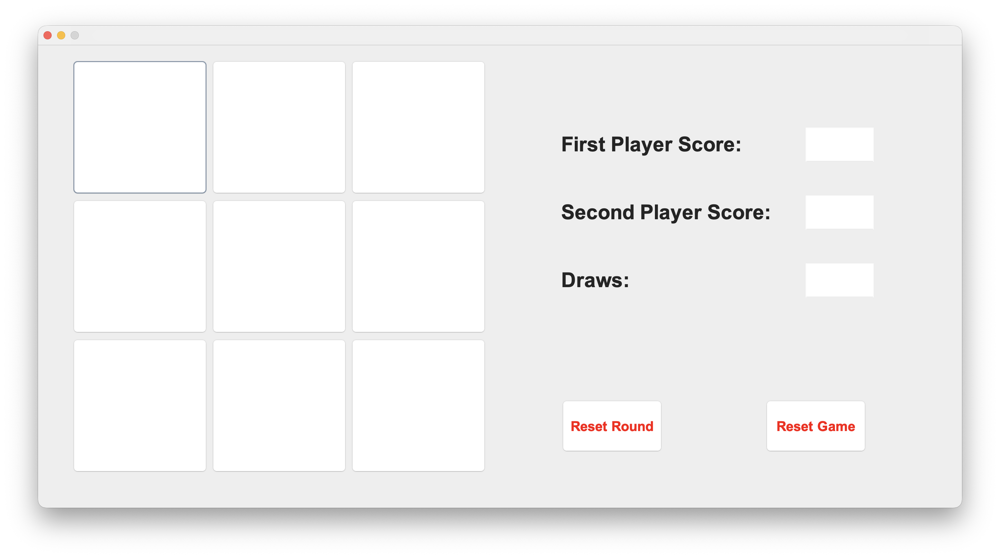
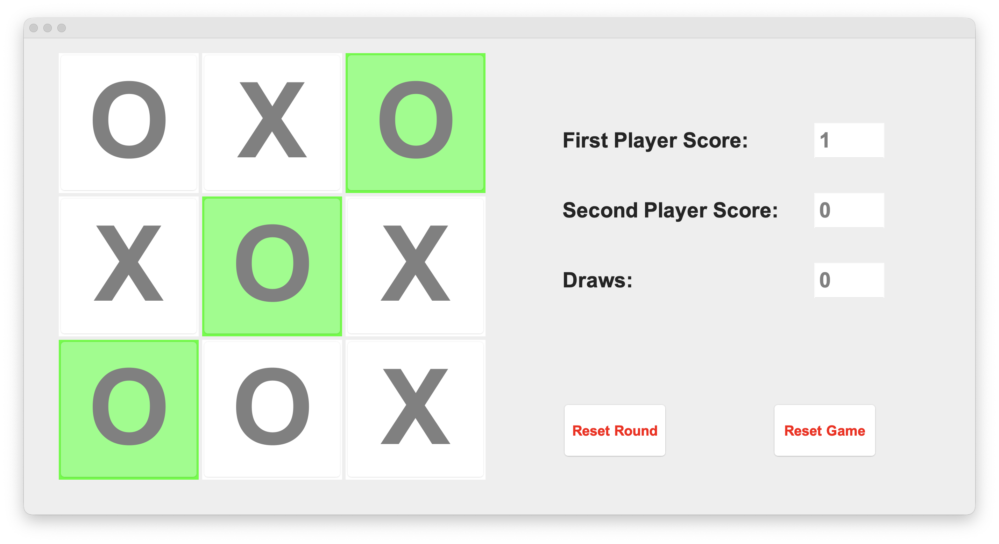

# Tic Tak Toe
 
 

This a a tic tac toe game make using only java.
 
It has following features:
 
<ul style="list-style-type: square;">
<li>Wining Check Engine</li>
<li>Login from DataBase Fetch</li>
<li>Reset Round</li>
<li>Reset Game</li>
</ul>

<h2 style="color: #a29292">Game Interface</h2>

  

    
  

  

    <h4 style="border: 2px solid #888; border-radius: 10px; padding: 15px; margin: 0; color: #ffffff; background-color: #383838; line-height: 1.5; text-align: center">
      Fill in the email and password which are connected to the <u><b>Database</b></u>.
    </h4>
  

<h2 style="color: #a29292">Game Interface</h2>

  

    
  

  

    <h4 style="border: 2px solid #888; border-radius: 10px; padding: 15px; margin: 0; color: #ffffff; background-color: #383838; line-height: 1.5; text-align:center">
      This is the Interface of the <b><u>Game</u></b>.
    </h4>
  

<h2 style="color: #a29292">Game Play</h2>

  

    
  

  

    <h4 style="border: 2px solid #888; border-radius: 10px; padding: 15px; margin: 0; color: #ffffff; background-color: #383838; line-height: 1.5; text-align:center">
      This is the Actual<b><u>Game Play</u></b>.
    </h4>
  

<h2 style="color: #a29292">Win Interface</h2>

  

    
  

  

    <h4 style="border: 2px solid #888; border-radius: 10px; padding: 15px; margin: 0; color: #ffffff; background-color: #383838; line-height: 1.5; text-align:center">
      This is <b><u>Wining</u></b> Interface.
    </h4>
  

